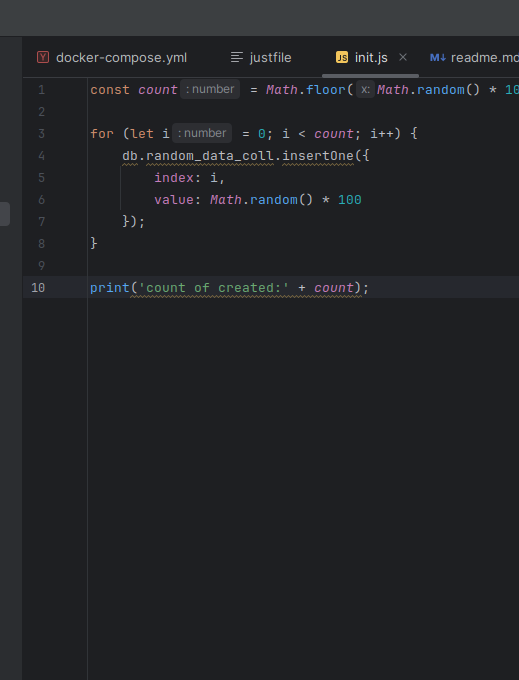

### Процесс выполнения ДЗ:
Мой пк на Linux Ubuntu 24.04.3 LTS.
Докер уже стоял - используется для работы.

#### Описал Dockerfile, docker-compose.yml: контейнер с mongo, прокинул volumes (ssh ключи, чтобы не вводить каждый раз пароль), подключил network. Использовал последний образ с dockerhub: mongo:8.0.14.

#### Для удобства работы создал justfile (аналог makefile), описал команды работы с ключами, контейнером.

#### Подключился к контейнеру, через mongosh поработал с бд, коллекциями используя команды с занятия.

#### Написал скрипт генерации рандомного кол-ва документов в новой коллекции.

#### Запустил в mongosh.

#### Установил, изучил gui mongodb compass.

#### Также для удобства описал команды в readme.md.
