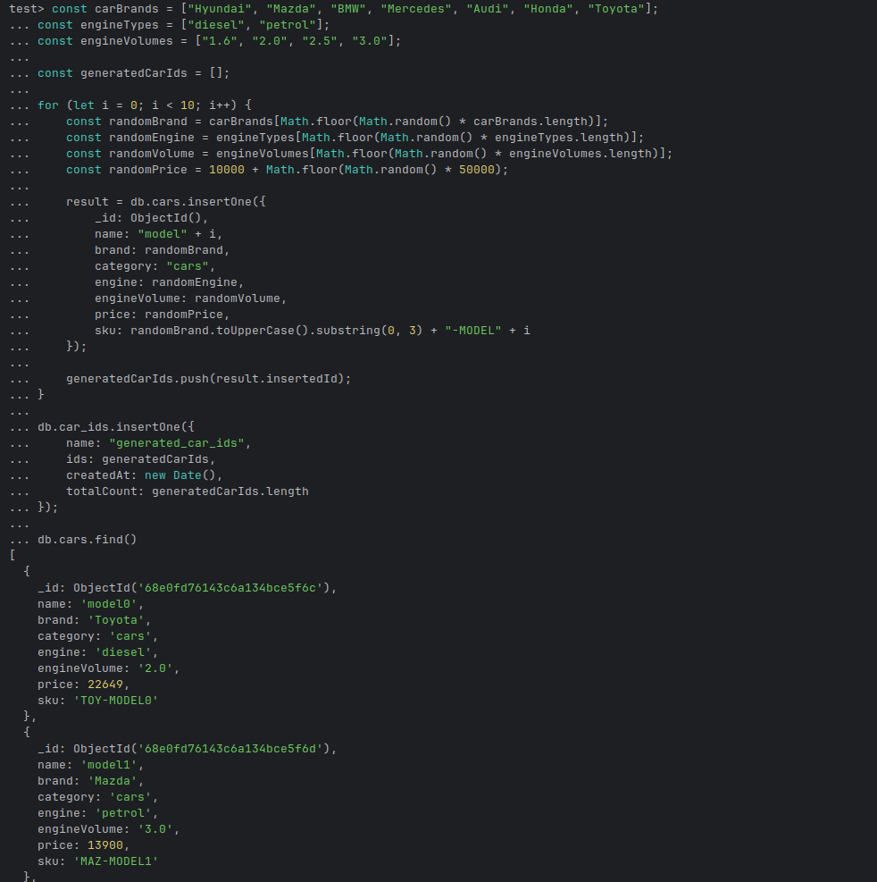
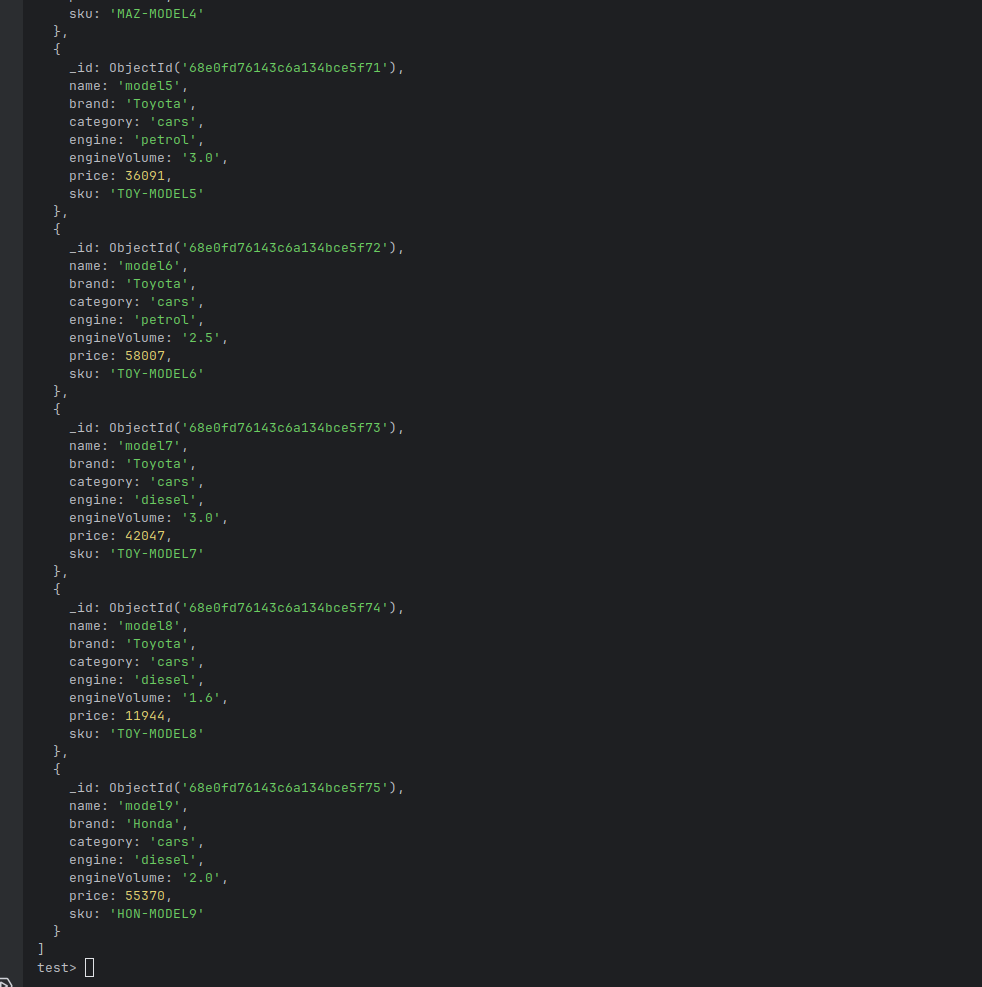
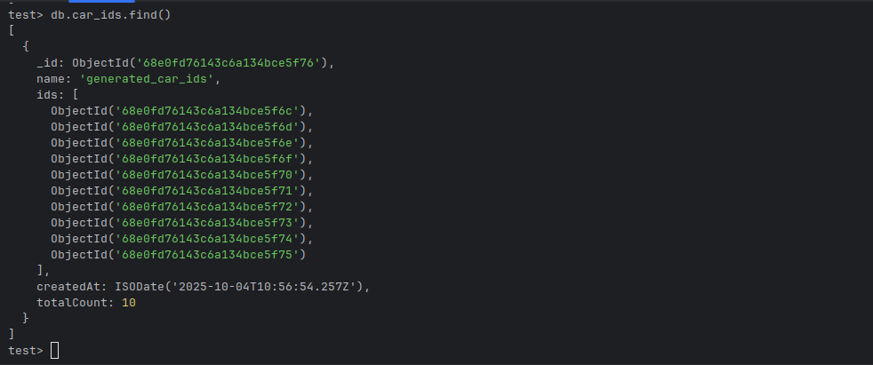
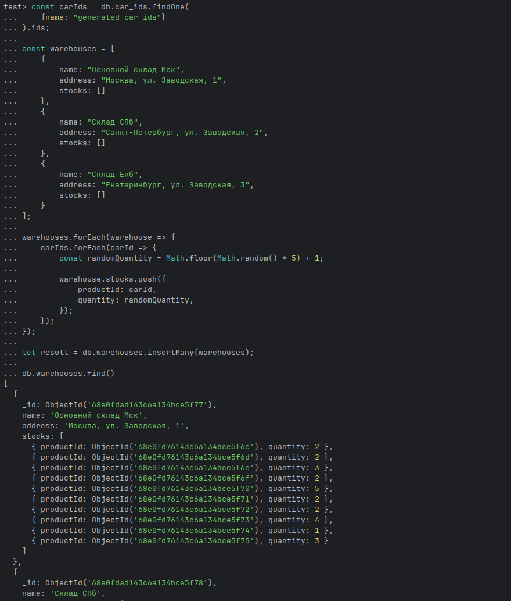
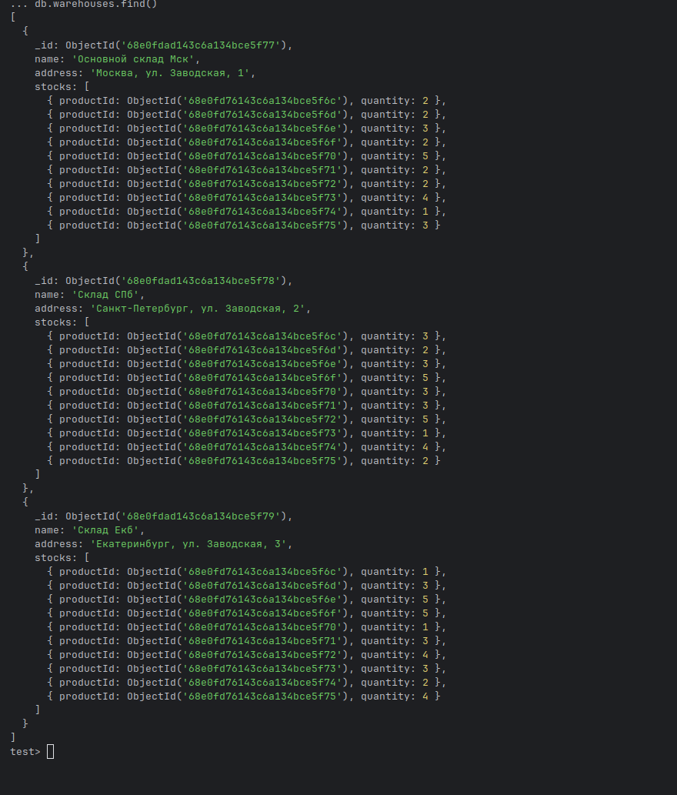
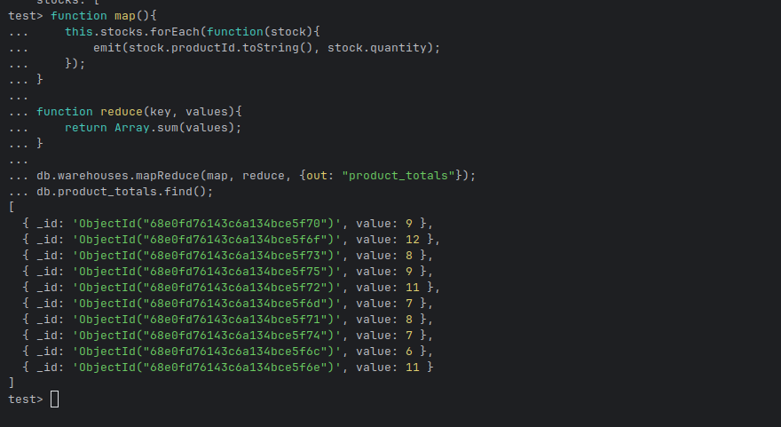
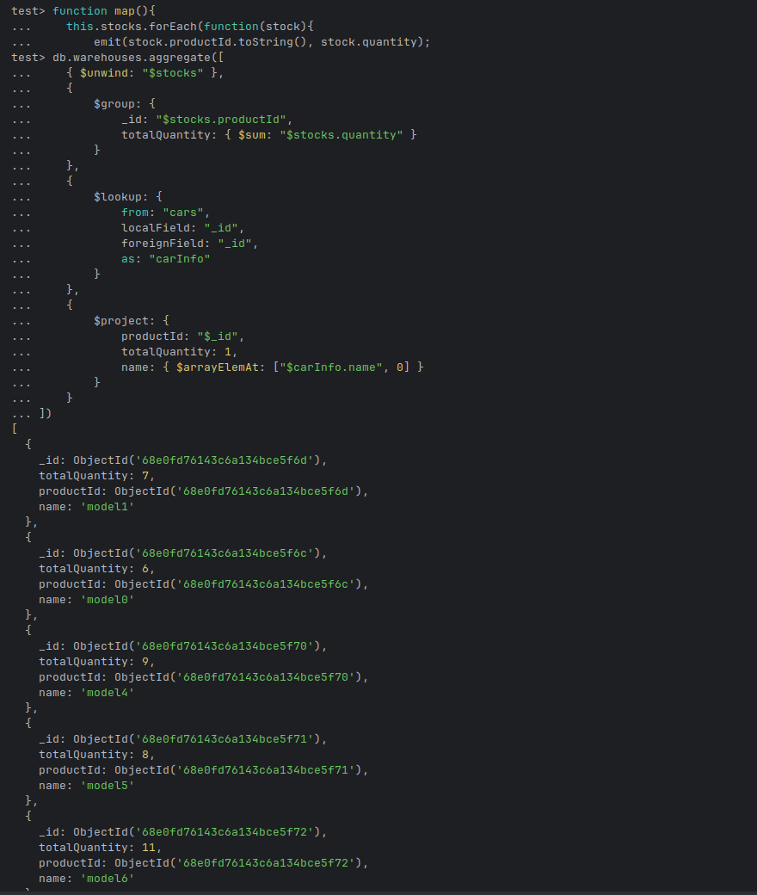

### Процесс выполнения ДЗ:
Написал генератор списка моделей авто

Сохранил ids авто в отдельную коллекцию, чтобы в будущем нагенерить складкие остатки

Написал генератор складких остатков

Получил результаты с использование
1. MapReduce

2. Aggregation framework

